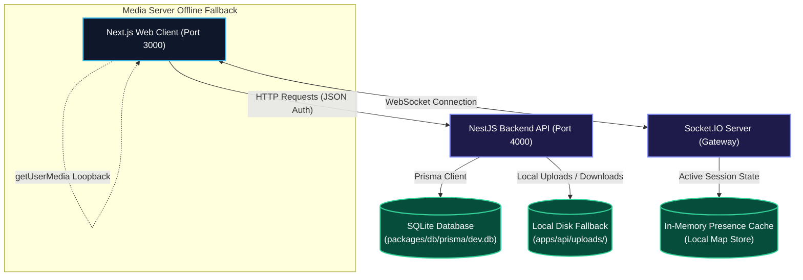

# Real-Time Video Support Platform — Evaluation Guide

This document contains the default login credentials and the system architecture diagram for evaluating the standalone local video support platform.

---

## 1. Evaluation Login Credentials

These credentials are pre-seeded into your local SQLite database:

### 👤 Support Agent (For testing support calls)
* **Email:** `agent@vsp.com`
* **Password:** `AgentPass123!`

### ⚙️ System Administrator (For dashboard monitoring)
* **Email:** `admin@vsp.com`
* **Password:** `AdminPass123!`

---

## 2. System Architecture Diagram (Standalone Fallback Mode)

This diagram shows how components communicate locally without Docker:

### Flow Explanation:
1. **Authentication**: Next.js client authenticates using JWT credentials. Token checks are processed natively by NestJS.
2. **Database Calls**: Schema matches and queries resolve to the local SQLite database client.
3. **Presence Cache**: Socket.IO maps user join/leave/reconnect rooms to a memory-based cache, avoiding Redis server requirements.
4. **File sharing**: Image/PDF attachments uploaded inside chat are saved directly inside `apps/api/uploads/` on your computer.
5. **RTC Media Loopback**: When the media server is offline, the client renders the local webcam stream side-by-side to simulate a call.
